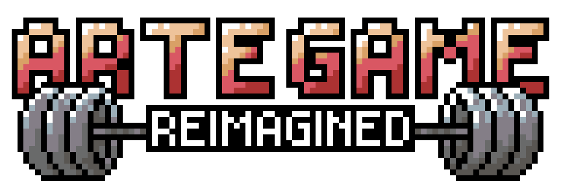

<p align="center">
  
  <br>
  <strong>Roguelite-RPG &bull; Bullet-hell &bull; Action-adventure</strong>
</p>

<p align="center">
  
  
  
  
</p>

---

# About the game

**Artegame Reimagined** is a fast-paced 2D top-down action roguelite blending bullet-hell evasion, punchy combat, and rich character progression. Developed from scratch in [Zig](https://ziglang.org) using the [Loom](https://github.com/ironloom/loom) game engine and [Clay](https://github.com/nicbarker/clay) declarative UI framework, the game challenges players to survive increasingly intense waves of foes while building synergistic smoothie-powered builds.


# Download

Pre-compiled, standalone binaries for **macOS**, **Linux**, and **Windows** are available on GitHub:

1. Visit the [Releases](https://github.com/zewenn/artegame/releases) page.
2. Download the latest archive for your platform:
   - `artegame-macos-arm64.zip` (Apple Silicon M1/M2/M3/M4)
   - `artegame-macos-x86_64.zip` (Intel macOS)
   - `artegame-linux-x86_64.tar.gz` (Standard Linux x86_64)
   - `artegame-windows-x86_64.zip` (Windows 10/11)
3. Extract the archive and launch the `artegame` executable directly.


# Build from source

Building Artegame Reimagined from source is fast and requires only the Zig compiler and Git.

### Prerequisites

- **[Zig](https://ziglang.org/download/)**: Version `0.16.0` or newer.
  > [!TIP]
  > We recommend using [zigup](https://github.com/marler8999/zigup) to effortlessly install and manage Zig compiler versions:
  > ```bash
  > zigup master
  > ```
- **Git**: For cloning the repository and fetching dependencies.

### Clone the Repository

```bash
git clone https://github.com/zewenn/artegame.git
cd artegame
```

### Run in Development

To compile and launch the game immediately in debug mode:

```bash
zig build run
```

### Build Optimized Release

To generate a fully optimized, standalone release binary:

```bash
zig build -Doptimize=ReleaseFast
```

The output binary will be located in:
```bash
./zig-out/bin/artegame
```

### Run Unit Tests

The test suite covers UI components, save persistence, BoonPool logic, and input helpers:

```bash
zig build test
```